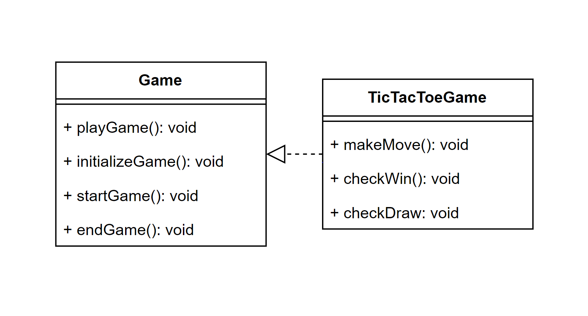

# Крестики-нолики

## Описание проекта

Проект "Крестики-нолики" реализует классическую игру для двух игроков. Игроки по очереди ставят свои символы (крестики или нолики) на игровом поле, стремясь выстроить их в ряды по горизонтали, вертикали или диагонали.

## Использованный паттерн

В данном проекте был использован шаблонный метод (Template Method). Этот паттерн был выбран, потому что он позволяет определить основной алгоритм игры в родительском классе, а дочерние классы могут переопределить определенные шаги этого алгоритма, чтобы адаптировать его под специфические требования.

## Плюсы использования шаблонного метода

- **Структурированность кода**: Шаблонный метод позволяет разделить алгоритм на отдельные шаги, что упрощает его понимание и поддержку.
- **Гибкость и расширяемость**: Подход, основанный на шаблонном методе, делает алгоритм гибким для расширения и изменения, так как каждый шаг может быть переопределен в дочерних классах.
- **Повторное использование кода**: Общие шаги алгоритма могут быть использованы многократно в различных контекстах, что способствует повторному использованию кода.
## Примеры использования паттерна

1. **Инициализация игры**: В родительском классе `Game` определен метод `initializeGame()`, который инициализирует игру. Этот метод вызывается в основном игровом цикле и может быть переопределен в дочерних классах для специфической инициализации, например, установки начального состояния игрового поля.

   Пример из кода:
   ```javascript
   class Game {
       initializeGame() {
           // Общая инициализация игры
       }
   }

   class TicTacToeGame extends Game {
       initializeGame() {
           super.initializeGame();
           // Специфическая инициализация для крестиков-ноликов
       }
   }
### UML - диаграмма



## Паттерн, который лучше не использовать

При разработке этого проекта было рассмотрено использование паттерна Одиночка (Singleton), который обеспечивает создание только одного экземпляра класса. Однако в данном случае использование этого паттерна не оправдано, так как игра в крестики-нолики не требует ограничения на количество экземпляров класса. Кроме того, использование Одиночки может затруднить тестирование и усложнить расширение функциональности в будущем.

## Системные требования

- Веб-браузер с поддержкой JavaScript

## Запуск проекта

1. Склонируйте репозиторий на свой компьютер.
2. Откройте файл index.html в вашем веб-браузере.
