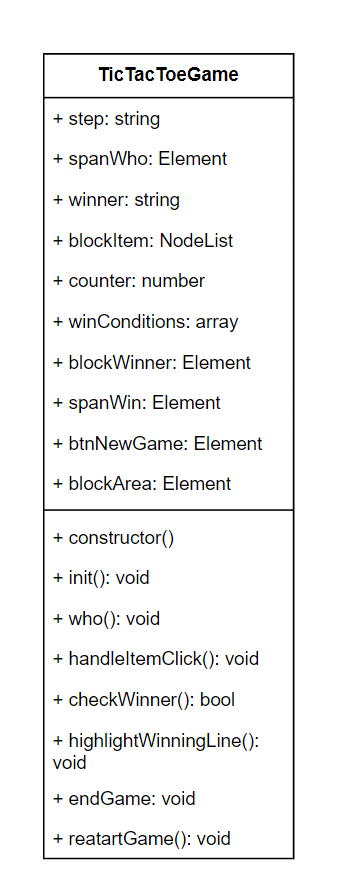

# Крестики-нолики

## Описание проекта

Проект "Крестики-нолики" реализует классическую игру для двух игроков. Игроки по очереди ставят свои символы (крестики или нолики) на игровом поле, стремясь выстроить их в ряды по горизонтали, вертикали или диагонали.

## Использованный паттерн

В данном проекте был использован шаблонный метод (Template Method). Этот паттерн был выбран, потому что он позволяет определить основной алгоритм игры в родительском классе, а дочерние классы могут переопределить определенные шаги этого алгоритма, чтобы адаптировать его под специфические требования.

## Плюсы использования шаблонного метода

- **Структурированность кода**: Шаблонный метод позволяет разделить алгоритм на отдельные шаги, что упрощает его понимание и поддержку.
- **Гибкость и расширяемость**: Подход, основанный на шаблонном методе, делает алгоритм гибким для расширения и изменения, так как каждый шаг может быть переопределен в дочерних классах.
- **Повторное использование кода**: Общие шаги алгоритма могут быть использованы многократно в различных контекстах, что способствует повторному использованию кода.
 
### UML - диаграмма

## Паттерн, который лучше не использовать

- **Жесткая связь**: Singleton создает жесткую связь между компонентами, что затрудняет их тестирование и поддержку.

- **Скрытая зависимость**: Использование Singleton приводит к скрытой зависимости между компонентами, что усложняет понимание кода.

- **Ограниченная гибкость**: Изменение и расширение Singleton может быть затруднено из-за его глобальной природы.

- **Проблемы многопоточности**: Реализация Singleton может быть не потокобезопасной, что приводит к проблемам в многопоточной среде.

- **Трудности в тестировании и масштабировании**: Использование Singleton усложняет тестирование и масштабирование приложения.

## Системные требования

- Веб-браузер с поддержкой JavaScript

## Запуск проекта

1. Склонируйте репозиторий на свой компьютер.
2. Откройте файл index.html в вашем веб-браузере.
